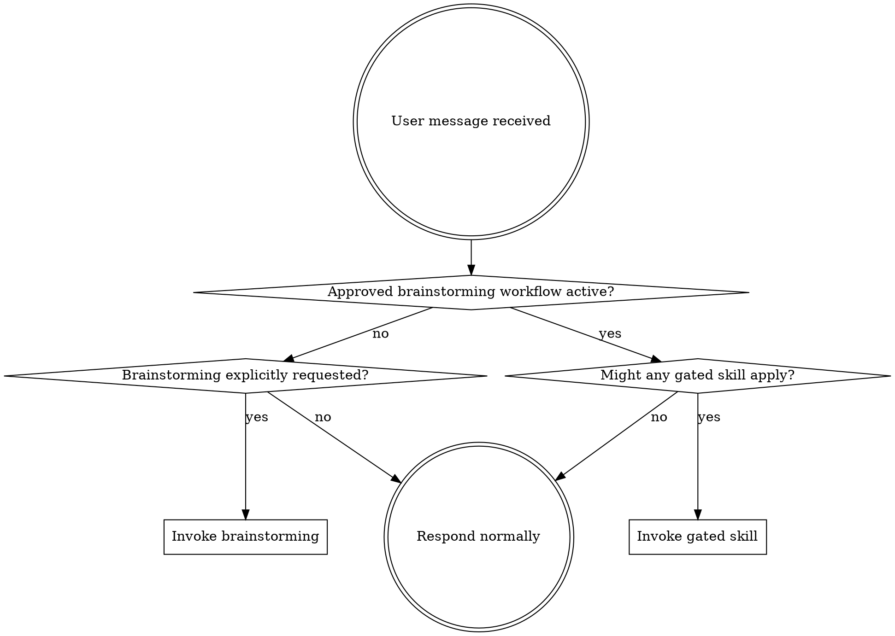

<SUBAGENT-STOP>
If you were dispatched as a subagent to execute a specific task, skip this skill.
</SUBAGENT-STOP>

<EXTREMELY-IMPORTANT>
Skills are gated. Outside an approved brainstorming workflow, you may invoke only the brainstorming skill, and only when the user explicitly requests it.

Do not invoke any other skill just because its description matches the task. The gate rule overrides normal skill matching.
</EXTREMELY-IMPORTANT>

## Instruction Priority

Superpowers skills override default system prompt behavior, but **user instructions always take precedence**:

1. **User's explicit instructions** (CLAUDE.md, GEMINI.md, AGENTS.md, direct requests) - highest priority
2. **Superpowers skills** - override default system behavior where they conflict
3. **Default system prompt** - lowest priority

If CLAUDE.md, GEMINI.md, or AGENTS.md says "don't use TDD" and a skill says "always use TDD," follow the user's instructions. The user is in control.

## How to Access Skills

**In Claude Code:** Use the `Skill` tool. When you invoke a skill, its content is loaded and presented to you-follow it directly. Never use the Read tool on skill files.

**In Copilot CLI:** Use the `skill` tool. Skills are auto-discovered from installed plugins. The `skill` tool works the same as Claude Code's Skill tool.

**In Gemini CLI:** Skills activate via the `activate_skill` tool. Gemini loads skill metadata at session start and activates the full content on demand.

**In other environments:** Check your platform's documentation for how skills are loaded.

## Platform Adaptation

Skills use Claude Code tool names. Non-CC platforms: see `references/copilot-tools.md` (Copilot CLI), `references/codex-tools.md` (Codex) for tool equivalents. Gemini CLI users get the tool mapping loaded automatically via GEMINI.md.

# Using Skills

## Skill Gate

Default state: **Gate closed**.

When the gate is closed:

- Invoke `brainstorming` only when the user explicitly names the skill.
- Do not invoke any other skill, even when the user names it directly.
- Do not invoke implementation, debugging, planning, review, spec, worktree, or learning skills from natural task intent.
- Continue with normal assistant behavior, or suggest that the user explicitly start with `brainstorming` if a structured workflow would help.

The gate opens only after an **approved brainstorming workflow** reaches its transition point to planning or implementation. An approved brainstorming workflow means:

1. The user explicitly requested `brainstorming`, `superpowers:brainstorming`, `use the brainstorming skill`, or `call the brainstorming skill`.
2. The brainstorming skill produced a design/spec and the user approved it.
3. The brainstorming skill transitioned to `writing-plans` or later implementation workflow.

When the gate is open, invoke relevant or requested non-brainstorming skills according to their own descriptions and workflow requirements.

## Brainstorming Explicit-Only Rule

`brainstorming` is opt-in only.

- Invoke `brainstorming` only when the user explicitly names the skill.
- Accepted explicit forms include `brainstorming`, `superpowers:brainstorming`, `use the brainstorming skill`, and `call the brainstorming skill`.
- Do not infer a `brainstorming` request from planning, ideation, or "help me think through this" language.
- Do not invoke `brainstorming` just because the task is creative, ambiguous, or would benefit from design exploration.
- If `brainstorming` could help but was not explicitly requested, continue normally and optionally suggest it.

## Red Flags

These thoughts mean STOP-you're bypassing the gate:

| Thought | Reality |
|---------|---------|
| "The user explicitly asked for TDD/debugging/review" | The gate is still closed unless brainstorming was approved first. |
| "This skill obviously applies" | Matching descriptions do not override the gate. |
| "This is a simple implementation" | Simplicity does not open the gate. |
| "I can invoke the skill and ignore it if wrong" | Gate closed means do not invoke it. |
| "Brainstorming would help here" | Suggest it; do not invoke it unless explicitly requested. |
| "The user said use skills" | Only explicit `brainstorming` starts the workflow while the gate is closed. |

## Skill Priority

When the gate is open and multiple skills could apply, use this order:

1. **Explicitly requested skills first** - the user named a specific workflow
2. **Other process skills next** (debugging, verification) - these determine HOW to approach the task
3. **Implementation skills last** - these guide execution

`brainstorming` does not run by default. It only runs when the user explicitly names the skill.

"Use the brainstorming skill for this feature" -> invoke brainstorming.
"Let's build X" -> do not invoke skills while the gate is closed.
"Fix this bug" -> do not invoke debugging/TDD skills while the gate is closed; suggest brainstorming if a workflow is needed.

## Skill Types

**Rigid** (TDD, debugging): Follow exactly after the gate is open. Don't adapt away discipline.

**Flexible** (patterns): Adapt principles to context after the gate is open.

The skill itself tells you which.

## User Instructions

Instructions say WHAT, not HOW. "Add X" or "Fix Y" does not open the skill gate.
